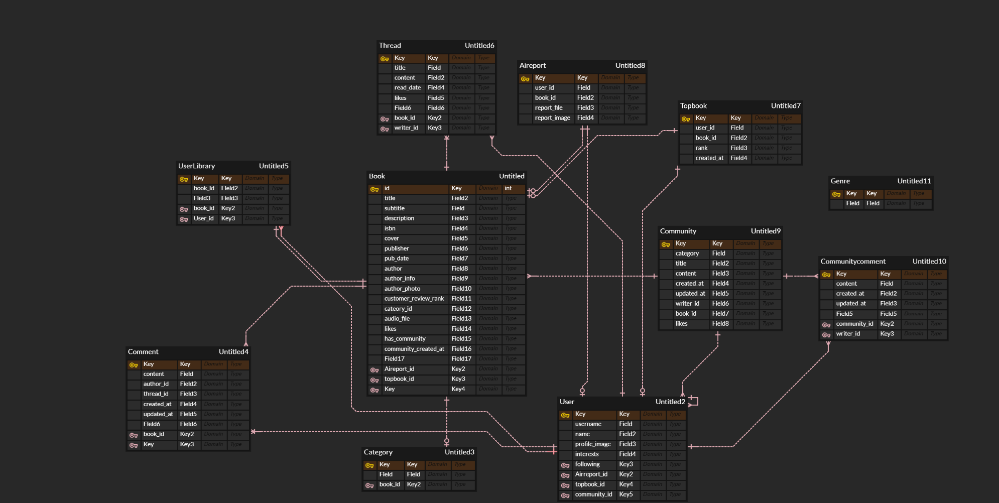

# AI 기반 도서 및 콘텐츠 추천 플랫폼

## 📖 프로젝트 소개
우리 서비스는 **AI 기반 도서 추천과 커뮤니티 기능**을 결합하여 독서 경험을 더욱 풍부하게 만들어줍니다.  
사용자는 책의 분위기나 느낌을 입력하면 AI가 분석하여 가장 잘 맞는 책 3권을 추천해주며,  
책을 좋아하는 사용자들이 모여 커뮤니티 활동도 할 수 있습니다.  

---

## 👥 팀원 정보 및 업무 분담

<table style="width:100%; border-collapse:collapse; text-align:center;">
  <tr>
    <th style="width:50%; border:1px solid #e5e7eb; padding:10px;">지현 (Frontend · Backend)</th>
    <th style="width:50%; border:1px solid #e5e7eb; padding:10px;">혜진 (Frontend · Backend)</th>
  </tr>
  <tr>
    <td style="border:1px solid #e5e7eb; padding:10px; text-align:left;">
      - 회원가입 / 로그아웃 기능 개발  
      - 마이페이지 구현 (대표 도서 설정, 읽은 책 분석 등)  
      - 메인페이지 구성  
      - 스레드 기능 일부  
      - AI 기반 영화 추천 기능  
      - AI 기반 음악 추천 기능  
      - AI 레포트 기능 및 저장
    </td>
    <td style="border:1px solid #e5e7eb; padding:10px; text-align:left;">
      - 로그인 기능 개발  
      - 도서 목록 페이지 구현 (도서 상세, 좋아요 등 포함)  
      - 스레드 기능 일부  
      - 메인페이지 구성  
      - 커뮤니티 기능 개발 (생성 / 조회 / 댓글)  
      - AI 기반 장소 추천 기능  
      - AI 기반 도서 추천 기능  
      - AI 레포트 기능 및 저장
    </td>
  </tr>
</table>

---

## 🎯 목표 서비스
- 사용자가 원하는 **분위기/느낌 기반 AI 도서 추천 서비스** 제공
- 책을 중심으로 한 **소셜 커뮤니티 활성화**
- **AI 리포트**를 통한 책·영화·음악·장소 등의 **확장된 문화 경험** 제공
- 독서 기록, 대표 도서, 장르별 통계를 통해 **개인화된 독서 데이터 관리**
- **오디오 기능**으로 독서 경험의 편의성 강화

---

## ⚙️ 구현 정도
- ✅ **AI 추천** : 분위기 기반 도서 추천 (정확도 순으로 3권)
- ✅ **커뮤니티** : 좋아요 수 기반 자동 생성, 스레드 작성/정렬 기능
- ✅ **마이페이지** : 서제 담기, 대표 도서 설정, 장르별 통계
- ✅ **오디오 기능** : gTTS 기반 도서 줄거리 음성 변환 및 재생
- ✅ **AI 리포트** :
  - GPT 기반 줄거리 요약
  - 중요 장소 지도 핀 & 설명
  - 관련 음악 5곡 추천
  - 관련 영화 3편 추천 + 예고편 YouTube 링크
  - 비슷한 도서 3권 추천
  - 리포트 저장 및 PDF 다운로드
- ⏳ **확장 가능성** :
  - 사용자 기반 추천 고도화 (협업 필터링 등)
  - 커뮤니티 내 이벤트 기능 확장
  - 리포트 공유 기능

---

## 🗄️ 데이터베이스 모델링

---

<!-- ====================== -->
<!-- ⚙️ Backend (Django/DRF) -->
<!-- ====================== -->
<h2>⚙️ Backend</h2>

  
  
  

  
  
  
  
  
  

<table style="width:85%; border-collapse:collapse; margin-top:14px;">
  <thead>
    <tr>
      <th style="background:#10b981;color:#fff;padding:10px;text-align:center;border:1px solid #e5e7eb;">Category</th>
      <th style="background:#10b981;color:#fff;padding:10px;text-align:center;border:1px solid #e5e7eb;">Stack</th>
    </tr>
  </thead>
  <tbody>
    <tr><td style="background:#f8fafc;padding:10px;border:1px solid #e5e7eb;"><strong>Language / Runtime</strong></td><td style="padding:10px;border:1px solid #e5e7eb;">Python 3.11</td></tr>
    <tr><td style="background:#f8fafc;padding:10px;border:1px solid #e5e7eb;"><strong>Web Framework</strong></td><td style="padding:10px;border:1px solid #e5e7eb;">Django 4.2.5, Django REST Framework 3.16.0</td></tr>
    <tr><td style="background:#f8fafc;padding:10px;border:1px solid #e5e7eb;"><strong>CORS / API Client</strong></td><td style="padding:10px;border:1px solid #e5e7eb;">django-cors-headers 4.7.0, httpx 0.28.1, requests 2.32.3</td></tr>
    <tr><td style="background:#f8fafc;padding:10px;border:1px solid #e5e7eb;"><strong>Media / Utils</strong></td><td style="padding:10px;border:1px solid #e5e7eb;">Pillow 10.0.1, gTTS 2.5.4, Wikipedia-API 0.8.1</td></tr>
    <tr><td style="background:#f8fafc;padding:10px;border:1px solid #e5e7eb;"><strong>AI / Validation</strong></td><td style="padding:10px;border:1px solid #e5e7eb;">OpenAI SDK 1.12.0, pydantic 2.10.6</td></tr>
    <tr><td style="background:#f8fafc;padding:10px;border:1px solid #e5e7eb;"><strong>Infra</strong></td><td style="padding:10px;border:1px solid #e5e7eb;">asgiref 3.7.2, anyio 4.8.0, tzdata 2023.3</td></tr>
  </tbody>
</table>

<!-- ========================= -->
<!-- 🎨 Frontend (Vue 3 + Vite) -->
<!-- ========================= -->
<h2>🎨 Frontend</h2>

<!-- Centered badges (버전 X) -->

  
  
  
  

  
  
  
  
  
  

<!-- Table (버전 O) -->

<table style="width:85%; border-collapse:collapse; margin-top:14px;">
  <thead>
    <tr>
      <th style="background:#0ea5e9;color:#fff;padding:10px 12px;text-align:center;border:1px solid #e5e7eb;">Category</th>
      <th style="background:#0ea5e9;color:#fff;padding:10px 12px;text-align:center;border:1px solid #e5e7eb;">Stack</th>
    </tr>
  </thead>
  <tbody>
    <tr><td style="background:#f8fafc;padding:10px;border:1px solid #e5e7eb;"><strong>Language</strong></td><td style="padding:10px;border:1px solid #e5e7eb;">JavaScript (ESNext)</td></tr>
    <tr><td style="background:#f8fafc;padding:10px;border:1px solid #e5e7eb;"><strong>Runtime / Build</strong></td><td style="padding:10px;border:1px solid #e5e7eb;">Vite 6.2.4</td></tr>
    <tr><td style="background:#f8fafc;padding:10px;border:1px solid #e5e7eb;"><strong>Framework</strong></td><td style="padding:10px;border:1px solid #e5e7eb;">Vue 3.5.13, Vue Router 4.5.0, Pinia 3.0.2</td></tr>
    <tr><td style="background:#f8fafc;padding:10px;border:1px solid #e5e7eb;"><strong>UI / Styling</strong></td><td style="padding:10px;border:1px solid #e5e7eb;">Bootstrap 5.3.6, Bootstrap-Vue 2.23.1</td></tr>
    <tr><td style="background:#f8fafc;padding:10px;border:1px solid #e5e7eb;"><strong>Networking</strong></td><td style="padding:10px;border:1px solid #e5e7eb;">axios 1.9.0</td></tr>
    <tr><td style="background:#f8fafc;padding:10px;border:1px solid #e5e7eb;"><strong>Export / Util</strong></td><td style="padding:10px;border:1px solid #e5e7eb;">html2canvas 1.4.1, html-to-image 1.11.13, jsPDF 3.0.1</td></tr>
    <tr><td style="background:#f8fafc;padding:10px;border:1px solid #e5e7eb;"><strong>UX Add-ons</strong></td><td style="padding:10px;border:1px solid #e5e7eb;">vue-toast-notification 3.1.3</td></tr>
  </tbody>
</table>

<!-- ========================= -->
<!-- 🔧 Versioning / Docs -->
<!-- ========================= -->
<h2>🔧 Versioning</h2>

  
  

<table style="width:75%; border-collapse:collapse; margin-top:14px;">
  <thead>
    <tr>
      <th style="background:#f97316;color:#fff;padding:10px;text-align:center;border:1px solid #e5e7eb;">Category</th>
      <th style="background:#f97316;color:#fff;padding:10px;text-align:center;border:1px solid #e5e7eb;">Usage</th>
    </tr>
  </thead>
  <tbody>
    <tr><td style="background:#f8fafc;padding:10px;border:1px solid #e5e7eb;"><strong>Git</strong></td><td style="padding:10px;border:1px solid #e5e7eb;">브랜치 전략 / PR 리뷰 / 태깅 / 릴리즈</td></tr>
    <tr><td style="background:#f8fafc;padding:10px;border:1px solid #e5e7eb;"><strong>Notion</strong></td><td style="padding:10px;border:1px solid #e5e7eb;">요구사항 / 기능 명세 / 회의록 / 스프린트 관리</td></tr>
  </tbody>
</table>

---

## 🤖 도서 추천 알고리즘 기술 설명

- 사용자가 현재 열람 중인 책의 **제목, 작가, 줄거리**와 함께 전체 도서 리스트(`books.json`)를 GPT에게 전달합니다.
- 프롬프트는 다음과 같은 방식으로 구성됩니다: "이 책을 좋아하는 사용자가 선호할 만한 도서를 추천해줘. 단, 추천 결과는 아래 리스트에 포함된 도서 중에서만 골라줘."
- GPT는 이를 바탕으로 추천 도서를 3권 제안하며, 추천 결과는 반드시 `books.json` 내부에 존재해야 합니다.
- 이 과정을 통해 추천의 정확성과 실효성을 확보합니다.

---

## ⚙️ 핵심 기능 설명

## 📲 기능 구성

<table>
  <tbody align="center"> 
    <tr> <th style="text-align: center"> 메인화면 </th> <th style="text-align: center"> 도서 목록 </th> </tr>
    <tr> <td width="50%"></td> 
        <td width="50%"></td> </tr> </tbody>
  <tbody align="center"> 
    <tr> <th style="text-align: center"> 로그인 </th> <th style="text-align: center"> 회원가입 </th> </tr>
    <tr> <td width="50%"></td>
    <td width="50%"></td> </tr> </tbody>
  <tbody align="center"> 
    <tr> <th style="text-align: center"> 도서 상세 및 오디오 읽어주기 생성</th> <th style="text-align: center"> 스레드 작성 </th> </tr>
    <tr> <td width="50%"></td>
    <td width="50%"></td> </tr>
  </tbody>
  <tbody align="center"> 
    <tr> <th style="text-align: center"> 커뮤니티 </th> <th style="text-align: center">  커뮤니티 상세 </th> </tr>
    <tr> <td width="50%"></td>
    <td width="50%"></td> </tr>
  </tbody>
  <tbody align="center"> 
    <tr> <th style="text-align: center"> 내 서제에 담기 </th> <th style="text-align: center"> 대표 도서 설정 </th> </tr>
    <tr> <td width="50%"></td>
    <td width="50%"></td> </tr>
  </tbody>
  <tbody align="center"> 
    <tr> <th style="text-align: center"> AI 리포트 </th> <th style="text-align: center">  AI 리포트 pdf 저장 </th> </tr>
    <tr> <td width="50%"></td>
    <td width="50%"></td> </tr>
  </tbody>
</table>

 

## 🖥️ 주요 기능

### 📚 기본 도서 기능
- 도서 목록 조회 / 상세보기
- 책 좋아요 및 좋아요 수 기반 커뮤니티 자동 생성
- 댓글 작성 기능 (책마다 댓글 달기 가능)
- 장르 기반 필터링 및 추천
- CRUD 기능 지원:
  - 회원가입 / 로그인 / 로그아웃
  - 마이페이지에서 사용자 데이터 관리
  - 대표 도서 설정 및 변경
  - 읽은 책 체크 기능
  - 댓글 삭제 / 수정

---

### 👥 커뮤니티 기능
- 좋아요 **100개 이상** 달린 도서 기준으로 자동 생성
- 말머리 기반 자유 게시판 형식 (잡담, 나눔 등 카테고리화 가능)
- 댓글/스레드 기능 (책마다 스레드 작성 가능, 최신순/좋아요순 정렬)
- 사용자 간 피드백 가능 (좋아요, 댓글 등 상호작용 강화)

---

### 🤖 AI 기능
- **AI 기반 도서 추천**
  - 현재 보고 있는 책 기반으로 GPT가 **유사 도서 3권 추천**
- **AI 감성 기반 추천**
  - “이런 느낌의 책이 읽고 싶다” → GPT가 분석 후 **정확도 순으로 3권 추천**
- **AI 리포트 생성**
  - 사용자가 읽은 책의 줄거리 요약
  - 책 속 중요 장소를 지도에 핀으로 표시 및 이유 설명
  - 관련 음악 5곡 추천
  - 관련 영화 3편 추천 (예고편 YouTube 링크 포함)
  - 비슷한 도서 3권 추천
  - 리포트 저장 및 PDF 다운로드 지원
- **TTS (Text-to-Speech) 기능**
  - 도서 줄거리를 음성으로 읽어주는 기능
- **통합 추천**
  - AI 분석 버튼 클릭 시, **영화 / 음악 / 장소**를 함께 추천

---

### 🧩 마이페이지 기능
- 내가 담은 책들을 모아 **서제 관리**
- **대표 도서 설정/변경**
- **장르별 통계 시각화** (내가 가장 많이 읽은 장르 확인 가능)
- 내가 생성/저장한 **AI 리포트 탭 제공**
- 저장된 리포트는 **PDF로 다운로드** 가능

---

## 💭 느낀 점 및 후기

- **기술적 경험**
- `Client.init() got an unexpected keyword argument 'proxies'` 오류는 `pip install --upgrade openai`로 해결
- `rest_framework` 없이도 Django에서 효율적으로 API 구현이 가능하다는 점을 알게 되었음
- 로컬 JSON 데이터 파일은 반드시 프로젝트 내 포함되어야 정상 작동함을 실습으로 깨달음

- **협업 및 개발 과정**
- 팀원 간 역할 분담과 커뮤니케이션의 중요성을 체감
- 프론트와 백엔드가 밀접하게 연결된 구조에서 실시간 반영이 필요한 점들이 많아 테스트와 소통의 빈도가 높았음
- Django의 전반적인 구조와 뷰 템플릿 로직을 동시에 다뤄보는 것은 처음이었지만, 실제 서비스 구현에 가까운 경험이 되었음

---

## ✍️ 기타 및 자유 작성

- 본 프로젝트는 단순한 도서 추천 서비스를 넘어서, AI를 활용한 **감성 기반 콘텐츠 추천**이라는 실험적인 시도였으며, 결과적으로 매우 높은 수준으로 완성할 수 있었습니다.
- 추천된 책, 음악, 영화, 장소 간의 연결성을 통해 한 권의 책을 중심으로 다양한 콘텐츠로 확장할 수 있다는 아이디어를 실제 구현한 점이 의미 있었습니다.
- 향후 발전 방향으로는 사용자 피드백 기반 추천 보정, 추천 정확도 개선, 사용자 성향 기반 프로필 추천 등이 가능할 것으로 기대됩니다.
